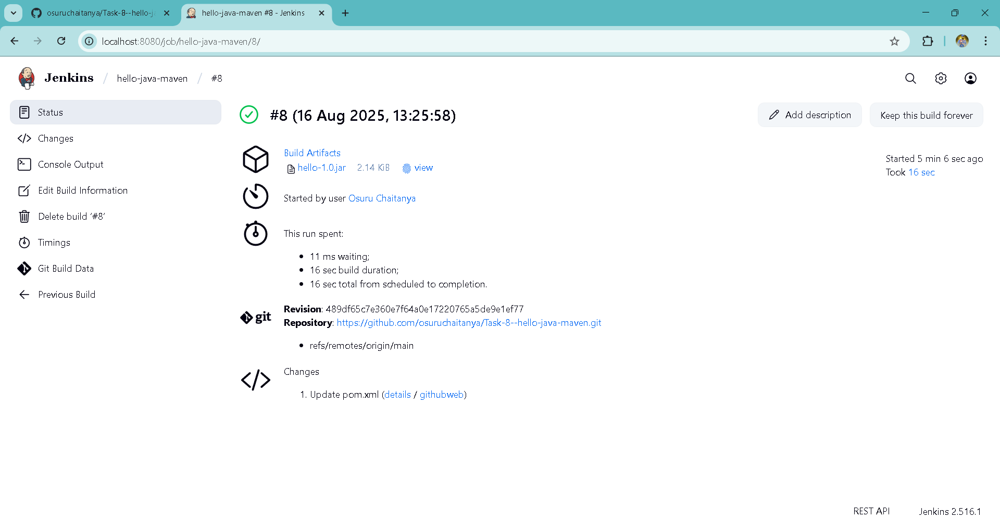

Got it 👍 — I’ll give you a clean README.md without the submission link or interview questions.


---

📄 README.md

# Hello Java Maven - Jenkins CI/CD Demo

This is a simple *Java HelloWorld application* built with *Maven* and integrated into *Jenkins* as part of a DevOps internship task.

---

## 📌 Project Overview
- A basic Java program that prints:

Hello, Jenkins + Maven!

- Configured with **Maven (pom.xml)** for build automation.
- Built and packaged in *Jenkins Freestyle Job* using mvn clean package.

---

## 🛠 Tools & Technologies
- *Java 21* (JDK)
- *Maven 3.x*
- *Jenkins (LTS via Docker)*
- *GitHub*

---

## 📂 Project Structure

hello-java-maven/ ├── src/ │   └── main/ │       └── java/ │           └── HelloWorld.java ├── pom.xml └── README.md

---

## ⚙ Jenkins Job Setup

1. *Start Jenkins*  
   ```bash
   docker run -p 8080:8080 jenkins/jenkins:lts

2. Configure Tools

Go to Manage Jenkins → Global Tool Configuration

Add JDK and Maven


3. Create Freestyle Job

New Item → Freestyle project → hello-java-maven

In Source Code Management, link this GitHub repo

In Build section → Invoke top-level Maven targets

Goal:

clean package


4. Build & Verify

Run job → Check Console Output

Expected result:

[INFO] BUILD SUCCESS


---

📦 Output

Maven generates a JAR file in:

target/hello-1.0.jar


---

📸 Screenshots

✅ Jenkins Job Configuration

✅ Console Output with BUILD SUCCESS

✅ Generated hello-1.0.jar


---

This version is *clean, professional, and submission-ready* ✅  

Do you want me to also add a **JUnit test file (HelloWorldTest.java)** so your Jenkins log won’t show “No tests to run”?
